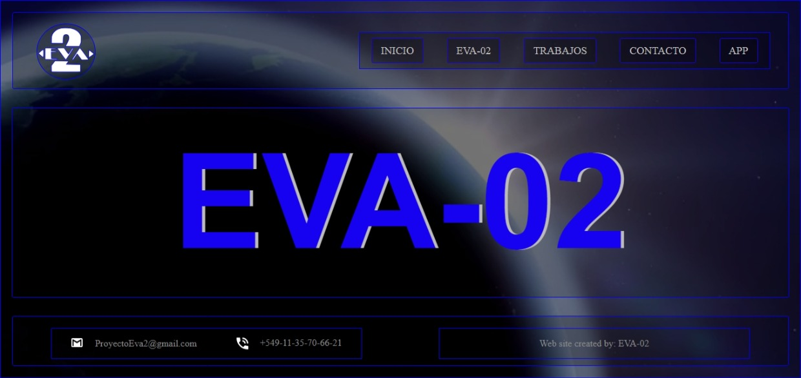

<h2>Hola esto es EVA-02</h2>

<!-- ## 👋 &nbsp;Hola, esto es EVA-02 -->
 

### 👨🏻‍💻 &nbsp;Acerca de EVA-02
💡 &nbsp;Eva 02 es una Empresa creada por Richard Demians Cúyo fin es dar presencia en internet a pequeñas marcas de comerciantes y artistas.\
🎓 &nbsp;Actualmente estamos en expanción, rumbo a abarcar mas areas del mercado.\
🌱 &nbsp;Hacemos desarrollo web fullstack, diseño Grafico,edición de audio y video.\
✍️ &nbsp;También desarrollamos aplicaciones según las necesidades del cliente.\
💬 &nbsp;No dudes en contactarnos para conocer más sobre nuestras habilidades tecnológicas, capacidades o simplemente ver los diferentes trabajos que hemos realizado.\
✉️ &nbsp;¡Puedes enviarnos un correo electrónico a proyectoeva2@gmail.com! IntentarEMOS responder tan pronto como sea posible.\
📄 &nbsp;Por favor, echa un vistazo a NUESTRO [Perfil](https://github.com/Eva-U2) para más detalles sobre EVA-02. ¡EstAMOS abiertoS a comentarios y sugerencias!
 
 

### 🛠 &nbsp;Conocimientos en:

<a href="https://developer.mozilla.org/es/docs/Learn/JavaScript/First_steps/What_is_JavaScript">
<a href="https://react.dev/">

 
 
 

### ⚙️ &nbsp;Mis Trabájos Realizados
 

  
  
  

 

### 🤝🏻 &nbsp;Contáctate con nosotros
 

 

-----

 
 Creditos: <a href="https://github.com/Eva-U2">[Richard Demians]</a>

 
 Ultima edicion 25/10/2023 

 
 E-MAIL: <a href="mailto:richard.demians@gmail.com">richard.demians@gmail.com</a>

