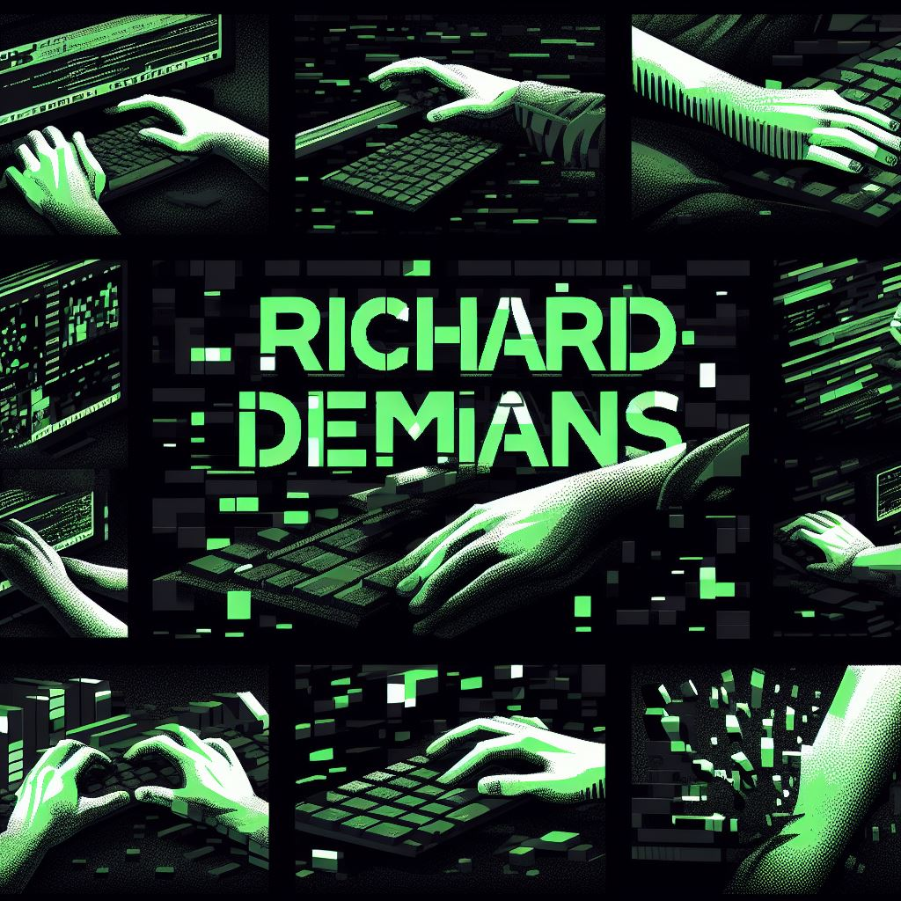

<h2>Hey there! I'm Richard</h2>

<!-- ## 👋 &nbsp;Hola, soy Richard -->
 

### 👨🏻‍💻 &nbsp;Acerca de mí
💡 &nbsp;Me gusta explorar nuevas tecnologías, aprendo rápido y me adapto fácilmente a grupos de trabajo.\
🎓 &nbsp;Actualmente estoy estudiando Desarrollo web en la Universidad de Avellaneda.\
🌱 &nbsp;Estoy en camino de aprender más sobre desarrollo web fullstack, inteligencia artificial y bases de datos.\
✍️ &nbsp;En mi tiempo libre, me dedico al diseño gráfico y al desarrollo de aplicaciones como pasatiempos/actividades secundarias.\
💬 &nbsp;No dudes en contactarme para conocer más sobre mis habilidades tecnológicas, capacidades o simplemente ver los diferentes trabajos que he realizado.\
✉️ &nbsp;¡Puedes enviarme un correo electrónico a richard.demians@gmail.com! Intentaré responder tan pronto como pueda.\
📄 &nbsp;Por favor, echa un vistazo a mi [Perfil](https://github.com/Eva-U2) para más detalles sobre mí. ¡Estoy abierto a comentarios y sugerencias!
 
 

### 🛠 &nbsp;Conocimientos en:

<a href="https://developer.mozilla.org/es/docs/Learn/JavaScript/First_steps/What_is_JavaScript">
<a href="https://react.dev/">

 
 
 

### ⚙️ &nbsp;Mis Trabájos Realizados
 

  
  
  

 

### 🤝🏻 &nbsp;Contáctate conmigo
 

 

-----

 
 Creditos: <a href="https://github.com/Eva-U2">[Richard Demians]</a>

 
 Ultima edicion 25/10/2023 

 
 E-MAIL: <a href="mailto:richard.demians@gmail.com">richard.demians@gmail.com</a>

